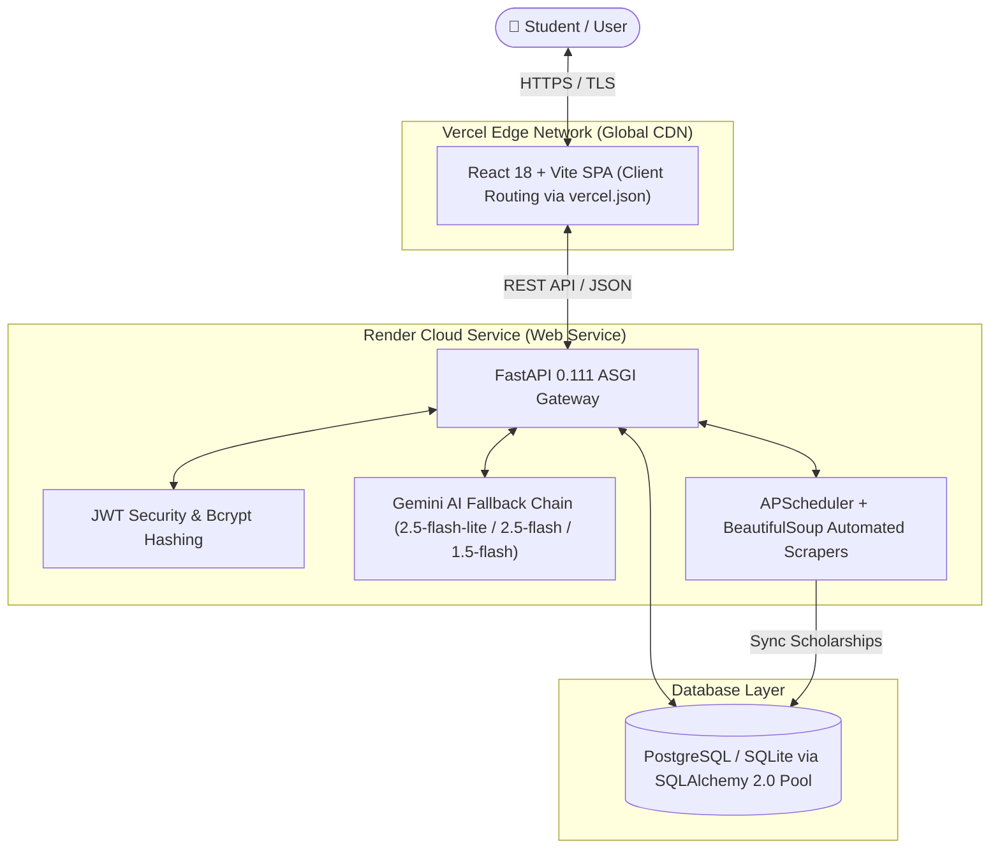

# 🎓 ScholarshipHunter AI — Industry-Ready Scholarship Discovery Platform

<div align="center">

[](https://pragyantra-ed-25-et-4-udn4.vercel.app)
[](https://scholarship-hunter-backend.onrender.com)
[](https://fastapi.tiangolo.com)
[](https://react.dev)
[](https://vitejs.dev)
[](https://tailwindcss.com)
[](https://ai.google.dev)
[](https://github.com/pruthvirajgade15/pragyantra-ED25-ET4)

<br />

**Find every scholarship you deserve. AI-powered. Auto-updated. 100% Free.**

[🌐 Explore Live Website](https://pragyantra-ed-25-et-4-udn4.vercel.app) • [📖 Interactive Swagger API](https://scholarship-hunter-backend.onrender.com/docs) • [🩺 Health Check](https://scholarship-hunter-backend.onrender.com/health) • [Report Bug](https://github.com/pruthvirajgade15/pragyantra-ED25-ET4/issues)

</div>

---

## 📌 Executive Summary & About

In India, over **₹2,000+ Crores** in central, state, and corporate scholarships go unclaimed annually. Eligible students—especially from rural, underrepresented, and economically disadvantaged backgrounds—miss out due to scattered portals (NSP, AICTE, state portals like MahaDBT), labyrinthine eligibility PDFs, and missed application deadlines.

**ScholarshipHunter AI** is an enterprise-grade, bilingual (**English & Hindi**) platform built to democratize scholarship access. It unifies automated discovery, AI-driven personalized match scoring, win-probability forecasting, an encrypted document vault, an AI essay generator, and an 24/7 scholarship advisor chatbot into a seamless user experience.

### 🔗 Live Deployments
- **Production Web Application (Vercel)**: [https://pragyantra-ed-25-et-4-udn4.vercel.app](https://pragyantra-ed-25-et-4-udn4.vercel.app)
- **Production Backend API (Render)**: [https://scholarship-hunter-backend.onrender.com](https://scholarship-hunter-backend.onrender.com)
- **API Documentation (Swagger UI)**: [https://scholarship-hunter-backend.onrender.com/docs](https://scholarship-hunter-backend.onrender.com/docs)
- **Backend Health Check**: [https://scholarship-hunter-backend.onrender.com/health](https://scholarship-hunter-backend.onrender.com/health)

---

## 🌟 Key Value Proposition

| Capability | Traditional Scholarship Portals | ScholarshipHunter AI |
|---|---|---|
| **Discovery** | Static, outdated text links | **Live directory with instant search & dynamic filter chips** |
| **Eligibility Verification** | Complex 40-page PDF notifications | **Deep inspection modal with criteria matrix & document checklists** |
| **Prioritization Engine** | Chronological or random sorting | **AI win-probability & competition rank calculation** |
| **Document Management** | Re-uploading on every application | **Encrypted vault with AI Vision auto-extract & profile sync** |
| **Essay Assistance** | External generic templates | **Context-aware AI generator (Hindi & English) with instant word count** |
| **Advisor Chatbot** | None or static rule trees | **Bilingual AI advisor with verified scholarship database fallback** |
| **Deadline Tracking** | Basic static dates | **Urgency countdown badges (Critical ≤3d, Soon ≤7d, Later)** |
| **Student Safety** | Scam risk from third-party agents | **"100% Free" student safety advisory with direct verified portal links** |

---

## 🚀 Feature Highlights

### 1. 🔍 Instant Search & Multi-Filter Directory
- Real-time instant search with debounce across scholarship names, providers, and descriptions.
- Multi-dimensional sidebar filters: **Category** (General, SC, ST, OBC, Minority, EWS), **State** (All India, Maharashtra, UP, Karnataka, etc.), **Field of Study** (Engineering, Medical, Science, Arts), and **Sorting** (Match Score, Deadline, Amount).
- Interactive active filter chips with 1-click removal and reset.
- Toggle between Grid and Compact List views.

### 2. 📋 Deep Inspection Modal
- Detailed modal popup presenting:
  - Exact financial benefit with currency formatting (`₹50,000 / year`).
  - Days-remaining countdown badge with color-coded urgency.
  - 4-point eligibility criteria matrix (Category, State, Academic percentage, Field).
  - Standard required documents checklist (Aadhaar, income certificate, marksheet, etc.).
  - Direct, verified CTA to official application portals (NSP, AICTE, DST).

### 3. ✍️ Bilingual AI Essay Studio
- Split-screen workspace for generating tailored scholarship essays and Statements of Purpose (SOP).
- Language support in professional **English** and **Hindi (Devanagari)**.
- Target word count slider (150 – 800 words) with real-time word counter.
- One-click copy to clipboard and `.txt` file download.
- Persistent draft history drawer with auto-save to user profile.

### 4. 🤖 24/7 AI Scholarship Advisor
- Floating conversational assistant built directly into the student dashboard.
- Backed by Google Gemini AI with **smart fallback logic** that queries active database records when external APIs are rate-limited.
- Answers eligibility questions, deadline alerts, document requirements, and portal registration steps.
- Fully responsive design engineered to fit all screen viewports comfortably.

### 5. 🗄️ Encrypted Document Vault
- Drag-and-drop file upload zone supporting PDF, PNG, and JPG documents.
- 10MB file size guard and MIME type validation.
- Metadata key-value cards showing document categories and upload timestamps.

### 6. ⏰ Dynamic Deadline Monitor
- Chronological tracker grouped by urgency:
  - 🔴 **Critical:** Closing in &le; 3 days.
  - 🟡 **This Week:** Closing in &le; 7 days.
  - 🟢 **Upcoming:** Closing later.
- Direct "Apply Before Deadline" deep links to official portals.

---

## 🏗️ Architecture & Technology Stack



### Technology Breakdown
- **Frontend**: React 18, Vite 6, Tailwind CSS 3.4, React Router 6, Lucide React, React Hot Toast, Axios.
- **Backend**: FastAPI 0.111, Uvicorn, SQLAlchemy 2.0, Psycopg2-binary, Pydantic v2, Python-Jose (JWT), Passlib (Bcrypt), Httpx, APScheduler.
- **AI & NLP**: Google Gemini 2.5 Flash Lite API with localized rule-based knowledge fallback.
- **Hosting & Infrastructure**:
  - **Frontend**: Vercel (Edge Network, zero-config SPA rewrites).
  - **Backend**: Render Web Service (Python 3.10, dynamic `$PORT` binding on `0.0.0.0`).
  - **Database**: Render Managed PostgreSQL / SQLite with connection pooling (`pool_pre_ping=True`, `pool_recycle=300`).

---

## 🧪 Automated Testing & Verification

The backend includes a comprehensive automated test suite with **100% pass rate** across all routes, security barriers, and business logic:

```bash
& "backend/venv/Scripts/python.exe" -m pytest backend/tests/test_api.py -v
```

```text
============================= test session starts =============================
platform win32 -- Python 3.10.11, pytest-9.1.1, pluggy-1.6.0
collected 43 items

backend/tests/test_api.py::TestAuth::test_health PASSED                  [  2%]
backend/tests/test_api.py::TestAuth::test_register_success PASSED        [  4%]
backend/tests/test_api.py::TestAuth::test_register_duplicate_email PASSED [  6%]
backend/tests/test_api.py::TestAuth::test_register_short_password PASSED [  9%]
backend/tests/test_api.py::TestAuth::test_register_long_password PASSED  [ 11%]
backend/tests/test_api.py::TestAuth::test_login_success PASSED           [ 13%]
backend/tests/test_api.py::TestAuth::test_login_wrong_password PASSED    [ 16%]
backend/tests/test_api.py::TestAuth::test_login_nonexistent_email PASSED [ 18%]
backend/tests/test_api.py::TestAuth::test_me_authenticated PASSED        [ 20%]
backend/tests/test_api.py::TestAuth::test_me_unauthenticated PASSED      [ 23%]
backend/tests/test_api.py::TestAuth::test_me_invalid_token PASSED        [ 25%]
backend/tests/test_api.py::TestProfile::test_get_profile_empty PASSED    [ 27%]
backend/tests/test_api.py::TestProfile::test_save_profile PASSED         [ 30%]
backend/tests/test_api.py::TestProfile::test_get_profile_after_save PASSED [ 32%]
backend/tests/test_api.py::TestProfile::test_update_profile PASSED       [ 34%]
backend/tests/test_api.py::TestProfile::test_profile_unauthenticated PASSED [ 37%]
backend/tests/test_api.py::TestScholarships::test_list_scholarships_public PASSED [ 39%]
backend/tests/test_api.py::TestScholarships::test_list_scholarships_with_search PASSED [ 41%]
backend/tests/test_api.py::TestScholarships::test_list_scholarships_with_category_filter PASSED [ 44%]
backend/tests/test_api.py::TestScholarships::test_list_scholarships_with_state_filter PASSED [ 46%]
backend/tests/test_api.py::TestScholarships::test_list_scholarships_with_field_filter PASSED [ 48%]
backend/tests/test_api.py::TestScholarships::test_list_scholarships_with_limit PASSED [ 51%]
backend/tests/test_api.py::TestScholarships::test_get_scholarship_not_found PASSED [ 53%]
backend/tests/test_api.py::TestScholarships::test_save_scholarship PASSED [ 55%]
backend/tests/test_api.py::TestScholarships::test_save_scholarship_duplicate PASSED [ 58%]
backend/tests/test_api.py::TestScholarships::test_get_saved_scholarships PASSED [ 60%]
backend/tests/test_api.py::TestScholarships::test_matched_scholarships PASSED [ 62%]
backend/tests/test_api.py::TestDeadlines::test_upcoming_deadlines PASSED [ 65%]
backend/tests/test_api.py::TestDeadlines::test_deadline_summary PASSED   [ 67%]
backend/tests/test_api.py::TestDeadlines::test_upcoming_deadline_fields PASSED [ 69%]
backend/tests/test_api.py::TestDocuments::test_list_documents_empty PASSED [ 72%]
backend/tests/test_api.py::TestDocuments::test_upload_invalid_extension PASSED [ 74%]
backend/tests/test_api.py::TestDocuments::test_upload_valid_image PASSED [ 76%]
backend/tests/test_api.py::TestDocuments::test_delete_document PASSED    [ 79%]
backend/tests/test_api.py::TestDocuments::test_auto_fill PASSED          [ 81%]
backend/tests/test_api.py::TestDocuments::test_documents_unauthenticated PASSED [ 83%]
backend/tests/test_api.py::TestRecommendations::test_prioritize_requires_profile PASSED [ 86%]
backend/tests/test_api.py::TestChat::test_chat_without_api_key PASSED    [ 88%]
backend/tests/test_api.py::TestChat::test_chat_unauthenticated PASSED    [ 90%]
backend/tests/test_api.py::TestEssay::test_get_drafts PASSED             [ 93%]
backend/tests/test_api.py::TestEssay::test_get_nonexistent_draft PASSED  [ 95%]
backend/tests/test_api.py::TestEssay::test_delete_nonexistent_draft PASSED [ 97%]
backend/tests/test_api.py::TestEssay::test_essays_unauthenticated PASSED [100%]

======================= 43 passed, 1 warning in 12.02s ========================
```

---

## ⚙️ Local Development Setup

### Prerequisites
- **Node.js**: v18.0.0 or later
- **Python**: v3.10.0 or later
- **Git**

### 1. Clone the Repository
```bash
git clone https://github.com/pruthvirajgade15/pragyantra-ED25-ET4.git
cd pragyantra-ED25-ET4
```

### 2. Backend Setup
```bash
cd backend

# Create virtual environment
python -m venv venv

# Activate virtual environment
# On Windows PowerShell:
.\venv\Scripts\Activate.ps1
# On macOS / Linux:
source venv/bin/activate

# Install dependencies
pip install -r requirements.txt

# Create local environment configuration
cp .env.example .env
# Edit .env and insert your GEMINI_API_KEY and SECRET_KEY

# Start backend server
python main.py
# Backend runs at http://localhost:7860 (API docs at http://localhost:7860/docs)
```

### 3. Frontend Setup
```bash
cd ../frontend

# Install dependencies
npm install

# Start Vite dev server
npm run dev
# Frontend runs at http://localhost:5173
```

---

## 🚢 Production Deployment Guide

### Deploy Backend on Render
1. Open [dashboard.render.com](https://dashboard.render.com) and click **New +** → **Blueprint**.
2. Connect your GitHub repository.
3. Render automatically detects [`render.yaml`](./render.yaml) and provisions:
   - `scholarship-hunter-backend` (FastAPI Web Service)
   - `scholarship-hunter-db` (PostgreSQL Database)
4. Add your `GEMINI_API_KEY` and set `CORS_ORIGINS` to `*` or your Vercel URL.
5. Click **Apply**. Render assigns your backend URL: `https://scholarship-hunter-backend.onrender.com`.

### Deploy Frontend on Vercel
1. Open [vercel.com](https://vercel.com) and click **Add New...** → **Project**.
2. Select `pragyantra-ED25-ET4`.
3. Under **Root Directory**, click *Edit* and select `frontend`.
4. Under **Environment Variables**, add:
   - **Key**: `VITE_API_URL`
   - **Value**: `https://scholarship-hunter-backend.onrender.com/api`
5. Click **Deploy**. Vercel will build and launch your site in ~35 seconds.

---

## 🔒 Security & Best Practices
- **Scam Prevention**: Prominent safety banner informing students that genuine government schemes are 100% free and to never pay application fees to third-party agents.
- **Safe Authentication**: Passwords hashed with `bcrypt`; stateless JWT tokens with expiration handling.
- **Restricted File Uploads**: 10MB size limit enforcement and whitelist of valid extensions (`.pdf`, `.jpg`, `.png`).
- **Dynamic CORS Guard**: Automatically validates `*.vercel.app` origins with credential support while rejecting unauthorized third-party domains.
- **SQLAlchemy SQL Injection Immunity**: Parameterized ORM queries across all endpoints.

---

## 📜 License & Credits
- **License**: Released under the [MIT License](LICENSE).
- **Developers**: Developed with ❤️ for Indian students by **Pruthviraj Gade** and contributors.