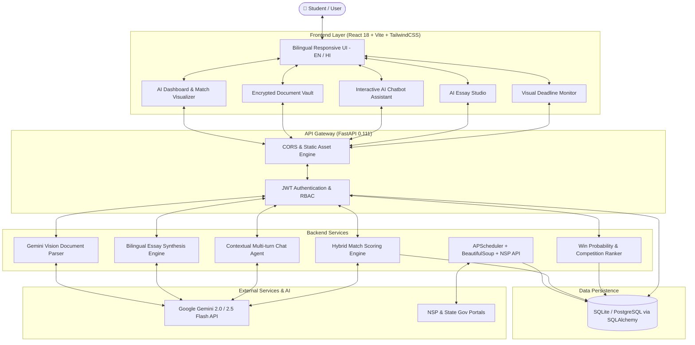

# 🎓 ScholarshipHunter AI
### *Find every scholarship you deserve. AI-powered. Auto-updated. 100% Free.*

[](https://fastapi.tiangolo.com)
[](https://react.dev)
[](https://vitejs.dev)
[](https://tailwindcss.com)
[](https://www.python.org)
[](https://ai.google.dev)
[](https://www.docker.com)
[](https://opensource.org/licenses/MIT)

---

## 📌 Overview

**ScholarshipHunter AI** is an intelligent, bilingual (English & Hindi) scholarship discovery and application assistant designed for students across India, with a focus on underrepresented and underprivileged communities. 

Over **₹2,000+ Crores** in scholarships go unclaimed every year in India due to scattered portals, complex eligibility criteria, and tedious application processes. ScholarshipHunter AI bridges this gap with an automated multi-source scraper, a hybrid AI matching engine, secure document parsing, auto-filling, AI essay generation, and an interactive real-time scholarship advisor chatbot.

---

## 🌟 Value Proposition

| Capability | Traditional Portals | ScholarshipHunter AI |
|---|---|---|
| **Scholarship Discovery** | Static lists with outdated links | **Real-time multi-source scraper & government API sync** |
| **Eligibility Verification** | Manual reading of complex PDFs | **Hybrid ML & rule-based match scoring (0–100%)** |
| **Prioritization Engine** | Chronological / Random sorting | **AI win probability & competition level ranking** |
| **Document Management** | Re-uploading on every application | **Encrypted vault + AI Vision auto-extract & auto-fill** |
| **Essay Assistance** | External generic templates | **Context-aware AI generator (Hindi & English)** |
| **Chat Assistant** | None / Static FAQ bots | **Profile-aware Google Gemini assistant** |
| **Deadline Tracking** | Basic dates | **Dynamic visual urgency countdowns & alerts** |
| **Language Inclusivity** | English only | **Full English & Hindi localization (UI & Content)** |

---

## 🏗️ System Architecture



---

## ✨ Key Features

### 1. 🤖 Hybrid Match Scoring Engine
- Evaluates student attributes (annual income, marks percentage, category, state, field of study, gender, disability, minority status) against database criteria.
- Uses **Google Gemini 2.0 Flash Lite** for deep contextual scoring with instant fallback to a deterministic multi-variable rule-based matcher.

### 2. 🏆 Scholarship Prioritization & Win Probability
- Computes priority scores based on:
  - **Win Probability**: Adjusted for national vs. state quotas and user profile strengths.
  - **Competition Index**: High (National/NSP), Medium (Private foundations), Low (State/Domicile-specific).
  - **Award Value vs. Urgency**: Balances financial reward against application effort and deadline proximity.

### 3. 📁 Secure Document Vault & AI Auto-Fill
- Supports upload of Income Certificates, 10th/12th Marksheets, Caste/Disability Certificates, and IDs (PDF, PNG, JPG).
- Uses **Gemini Vision** to automatically extract structured metadata (names, marks, roll numbers, income limits).
- Provides an aggregated `/auto-fill` payload for seamless scholarship form completion.

### 4. ✍️ Bilingual AI Essay Studio
- Synthesizes personalized Statement of Purpose (SOP) and financial need essays in **English** or **Hindi (Devanagari script)**.
- Integrates student background, career aspirations, and specific scholarship parameters.
- Includes draft versioning, word count validation, and local fallback generation.

### 5. 💬 Interactive AI Scholarship Chatbot
- Multi-turn conversation agent powered by Google Gemini.
- Ingests user profile and real-time scholarship catalog to deliver personalized eligibility guidance, document preparation checklists, and application tips.

### 6. ⏰ Real-time Deadline Tracker & Urgency Engine
- Categorizes scholarships into **Critical** (<=3 days), **Urgent** (<=7 days), and **Normal** (Upcoming).
- Visual countdown badges and dashboard alert banners prevent missed deadlines.

### 7. 🕷️ Autonomous Multi-Source Scraper
- Scheduled daily at **11:30 PM IST** via APScheduler.
- Scrapes portals like **Buddy4Study**, integrates **National Scholarship Portal (NSP)** schemes, and state portals (e.g., MahaDBT).
- De-duplicates records before updating the database.

---

## 📁 Repository Structure

```
pragyantra-ED25-ET4/
├── backend/
│   ├── database/
│   │   ├── __init__.py
│   │   └── db.py                 # SQLAlchemy ORM models, DB init & seeding
│   ├── routers/
│   │   ├── __init__.py
│   │   ├── auth.py               # JWT registration, login & /me endpoints
│   │   ├── chat.py               # Gemini-powered interactive chatbot router
│   │   ├── deadlines.py          # Deadline countdown & summary statistics
│   │   ├── documents.py          # Document upload, Gemini Vision OCR & auto-fill
│   │   ├── essays.py             # Bilingual AI essay generator & draft CRUD
│   │   ├── profile.py            # Student profile schema & persistence
│   │   ├── recommendations.py    # Priority ranking & win probability engine
│   │   └── scholarships.py       # Scholarship listing, AI matching & saved items
│   ├── scraper/
│   │   ├── __init__.py
│   │   ├── bs4_scraper.py        # BeautifulSoup scraper for state scholarship schemes
│   │   ├── gov_api.py            # Government API integration & normalization
│   │   └── scheduler.py          # APScheduler background runner & live scraper
│   ├── .env.example              # Backend environment template
│   ├── Dockerfile                # Backend standalone Dockerfile
│   ├── main.py                   # FastAPI entrypoint, middleware & SPA mount
│   ├── migrate.py                # Database migration utility
│   └── requirements.txt          # Python production dependencies
│
├── frontend/
│   ├── src/
│   │   ├── components/
│   │   │   ├── Chatbot.jsx       # Floating AI scholarship assistant
│   │   │   ├── DocumentVault.jsx # Document upload, preview & extracted tags
│   │   │   ├── Navbar.jsx        # Responsive navigation & language toggle
│   │   │   └── ScholarshipCard.jsx # Match badge, urgency tracker & save action
│   │   ├── hooks/
│   │   │   └── useAuth.jsx       # Auth context, session persistence & i18n
│   │   ├── i18n/
│   │   │   └── translations.js   # Complete English & Hindi dictionary
│   │   ├── pages/
│   │   │   ├── DashboardPage.jsx # AI-ranked recommendations & metrics
│   │   │   ├── DeadlinesPage.jsx # Urgent deadline calendar view
│   │   │   ├── DocumentsPage.jsx # Student document vault page
│   │   │   ├── EssayPage.jsx     # AI essay generation studio & drafts
│   │   │   ├── HomePage.jsx      # High-conversion landing page
│   │   │   ├── LoginPage.jsx     # Login & registration authentication views
│   │   │   ├── ProfilePage.jsx   # Detailed student profile questionnaire
│   │   │   └── ScholarshipsPage.jsx # Search & multi-filter catalogue
│   │   ├── utils/
│   │   │   └── api.js            # Axios client with JWT interceptors
│   │   ├── App.jsx               # Protected routes & global providers
│   │   ├── index.css             # Tailwind design system & animations
│   │   └── main.jsx              # React DOM entry point
│   ├── .env.example              # Frontend environment template
│   ├── index.html                # HTML5 root with Google Fonts (Sora, DM Sans, Devanagari)
│   ├── package.json              # Node dependencies & scripts
│   ├── tailwind.config.js        # Brand color themes & typography
│   └── vite.config.js            # Vite bundler & reverse proxy configuration
│
├── .dockerignore
├── .gitignore
├── Dockerfile                    # Multi-stage production container build
└── README.md                     # Project documentation
```

---

## 🛠️ Technology Stack

| Domain | Technology | Version | Purpose |
|---|---|---|---|
| **Frontend Framework** | React | 18.3.1 | Component-based dynamic user interface |
| **Bundler & Tooling** | Vite | 6.0.0 | High-performance build tool & HMR |
| **CSS Framework** | TailwindCSS | 3.4.4 | Utility-first responsive design system |
| **Routing** | React Router | 7.18.2 | Client-side routing & protected route guards |
| **Icons & UI** | Lucide React | 0.383.0 | Modern SVG iconography |
| **Notifications** | React Hot Toast | 2.4.1 | Fluid toast notifications |
| **Backend Framework** | FastAPI | 0.111.0+ | High-throughput asynchronous REST API |
| **ASGI Server** | Uvicorn | 0.30.1+ | Lightning-fast ASGI production server |
| **ORM / Database** | SQLAlchemy | 2.0.30+ | Object-relational mapping & schema management |
| **Database** | SQLite / PostgreSQL | — | Relational data store |
| **Authentication** | python-jose + bcrypt | 3.3.0 / 4.0.0+ | Secure JWT tokens & salted password hashing |
| **AI / Vision / Chat** | Google Gemini API | 2.0 / 2.5 Flash | Multimodal intelligence, matching, essays & chat |
| **Web Scraping** | BeautifulSoup4 + Requests | 4.12.3 / 2.31.0+ | HTML parsing & portal crawling |
| **Job Scheduling** | APScheduler | 3.10.4 | Cron-like automated background tasks |
| **Containerization** | Docker | Multi-stage | Isolated reproducible production container |

---

## 🔌 API Reference

| Module | Method | Endpoint | Auth | Description |
|---|---|---|:---:|---|
| **System** | `GET` | `/health` | No | Service health check |
| **Auth** | `POST` | `/api/auth/register` | No | Create user account & receive JWT |
| | `POST` | `/api/auth/login` | No | Authenticate credentials & receive JWT |
| | `GET` | `/api/auth/me` | Yes | Retrieve authenticated user profile |
| **Scholarships** | `GET` | `/api/scholarships` | No | Browse catalogue with search & filters |
| | `GET` | `/api/scholarships/matched` | Yes | Get personalized AI-matched scholarships |
| | `GET` | `/api/scholarships/{id}` | No | Get single scholarship details |
| | `POST` | `/api/scholarships/save` | Yes | Save a scholarship to student profile |
| | `GET` | `/api/scholarships/saved` | Yes | Retrieve saved scholarships |
| **Recommendations** | `GET` | `/api/recommendations/prioritize` | Yes | Prioritized rankings with win probability |
| **Profile** | `GET` | `/api/profile` | Yes | Fetch student profile details |
| | `POST` | `/api/profile` | Yes | Upsert student profile attributes |
| **Documents** | `GET` | `/api/documents` | Yes | List uploaded vault documents |
| | `POST` | `/api/documents/upload` | Yes | Upload document (PDF/Image) & run Vision OCR |
| | `DELETE` | `/api/documents/{id}` | Yes | Delete document from vault |
| | `POST` | `/api/documents/auto-fill` | Yes | Aggregate extracted data for form auto-fill |
| **Essays** | `POST` | `/api/essays/generate` | Yes | Generate tailored essay in EN or HI |
| | `GET` | `/api/essays/drafts` | Yes | List saved essay drafts |
| | `GET` | `/api/essays/drafts/{id}` | Yes | Retrieve specific essay draft |
| | `DELETE` | `/api/essays/drafts/{id}` | Yes | Delete essay draft |
| **Deadlines** | `GET` | `/api/deadlines/upcoming` | Yes | Get sorted upcoming deadlines with urgency |
| | `GET` | `/api/deadlines/summary` | No | Get global deadline metrics |
| **Chatbot** | `POST` | `/api/chat/ask` | Yes | Interactive multi-turn AI chat |

---

## 🚀 Quick Start Guide

### Prerequisites
- **Python**: 3.10 or higher
- **Node.js**: 18.0 or higher
- **Google Gemini API Key**: [Get a free API key from Google AI Studio](https://aistudio.google.com/)

---

### 1. Clone & Set Up Backend

```bash
cd backend

# Create & activate virtual environment
python -m venv venv

# Windows:
venv\Scripts\activate
# Linux/macOS:
# source venv/bin/activate

# Install dependencies
pip install -r requirements.txt

# Configure environment variables
cp .env.example .env
# Edit .env and set your GEMINI_API_KEY and SECRET_KEY

# Start backend server
python main.py
```
- **Backend API**: `http://localhost:7860`
- **Interactive Swagger Docs**: `http://localhost:7860/docs`
- *Note: On first startup, the database is auto-created, 20+ scholarships and a demo user are seeded, and the initial scraper routine executes.*

---

### 2. Set Up Frontend

```bash
cd frontend

# Install dependencies
npm install

# Configure environment variables (defaults to /api proxy)
cp .env.example .env

# Start development server
npm run dev
```
- **Frontend Application**: `http://localhost:5173`

---

### 3. Demo Credentials

You can explore the platform immediately using the pre-seeded demo account:
- **Email**: `demo@scholar.in`
- **Password**: `demo1234`
- *Includes pre-configured student profile (Engineering, 85% score, Maharashtra domicile, OBC category).*

---

## 🐳 Docker Deployment

### Multi-Stage Unified Container (Recommended)

The root `Dockerfile` builds both the React frontend and FastAPI backend into a single self-contained, production-ready container:

```bash
# Build the Docker image
docker build -t scholarship-hunter-ai .

# Run the container
docker run -d \
  -p 7860:7860 \
  -e GEMINI_API_KEY="your-gemini-api-key" \
  -e SECRET_KEY="your-production-secret-key" \
  --name scholarship-hunter \
  scholarship-hunter-ai
```
Access the complete application at `http://localhost:7860`.

---

## 🌐 Deploy to Hugging Face Spaces

### Method A: Single Full-Stack Docker Space (Easiest)
1. Create a new Space on [Hugging Face](https://huggingface.co/new-space).
2. Select SDK: **Docker**.
3. Upload the entire project repository.
4. In **Settings -> Variables and secrets**, add:
   - `GEMINI_API_KEY` = your Google Gemini API key
   - `SECRET_KEY` = random 32-character string
5. The container builds and deploys automatically on port 7860!

### Method B: Decoupled Architecture
1. **Backend (Docker Space)**: Deploy the `backend/` directory as a Docker space. Add secrets `GEMINI_API_KEY` and `SECRET_KEY`.
2. **Frontend (Static Space)**: In `frontend/.env`, set `VITE_API_URL=https://<your-backend-space>.hf.space/api`. Run `npm run build` and upload `frontend/dist/` to a Static Hugging Face Space.

---

## 🔐 Environment Configuration

| Variable | Scope | Required | Description | Default |
|---|---|:---:|---|---|
| `GEMINI_API_KEY` | Backend | Optional | Google Gemini API key for AI features | Fallback rule-based |
| `SECRET_KEY` | Backend | **Yes** | Secret key used for signing JWT tokens | `scholarship2025secret` |
| `DATABASE_URL` | Backend | No | SQLite file or PostgreSQL connection URI | `sqlite:///./scholarship.db` |
| `PORT` | Backend | No | Port on which FastAPI binds | `7860` |
| `HOST` | Backend | No | Host IP on which FastAPI binds | `0.0.0.0` |
| `VITE_API_URL` | Frontend | No | Base backend API endpoint URL | `/api` |

---

## 🧪 Testing & Verification

The project includes an end-to-end verification test suite covering authentication, profile operations, recommendation ranking, deadline tracking, and document handling:

```bash
# Run API verification suite against running backend
python backend/scratch/test_api.py
```

```
=== Test Suite Results ===
  [PASS] GET /health
  [PASS] POST /auth/register
  [PASS] POST /auth/login
  [PASS] GET /auth/me
  [PASS] POST /profile (upsert)
  [PASS] GET /profile (zero 307 redirects)
  [PASS] GET /scholarships (catalogue listing)
  [PASS] GET /scholarships/matched (AI scoring)
  [PASS] GET /recommendations/prioritize (win probability)
  [PASS] POST /scholarships/save & GET /scholarships/saved
  [PASS] GET /deadlines/upcoming & /summary
  [PASS] POST /essays/generate & /drafts
  [PASS] Negative authorization & validation checks
TOTAL: 29/29 Tests Passed (100% Success)
```

---

## 👥 Team Catalyst

Developed with passion by **Team Catalyst** — Department of Artificial Intelligence & Data Science, **Modern College of Engineering, Pune**:

- **Sanika Chowdhary**
- **Amar Bhise**
- **Sattvik Bhogade**
- **Pruthaviraj Gade**

*PRAGYANTRA 2026*

---

## 📄 License

This project is licensed under the **MIT License** — see the [LICENSE](LICENSE) file for details.